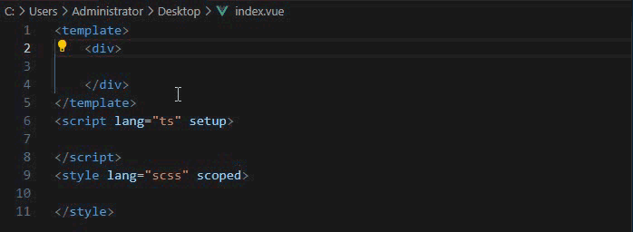

# Vue3 snippets plus

a Vue3 and vue2 code snippets extension for vscode.

### Illustrate

You just need to type the code normally, and it will give you a prompt on its own, making you type faster.

### Operation demonstration

### Partial examples

| keyword              | snippet(Autoformat)                                                                                   |
| :------------------- | :---------------------------------------------------------------------------------------------------- |
| vue3                 | `<template>

</template>` |
| template             | `<template>

</template>`                                                                    |
| component            | `<component :is="" />`                                                                                |
| suspense             | `<Suspense><template #default></template><template #fallback></template></Suspense>`                  |
| transition           | `<Transition mode="default"></Transition>`                                                            |
| transitionGroup      | `<TransitionGroup name="" tag=""></TransitionGroup>`                                                  |
| keepAlive            | `<KeepAlive></KeepAlive>`                                                                             |
| teleport             | `<Teleport to="" :disabled=""></Teleport>`                                                            |
| routerview           | `<router-view v-slot="{route, Component}"></router-view>`                                             |
| routerlink           | `<router-link to=""></router-link>`                                                                   |
| script               | ``                                                                   |
| scss                 | ``                                                                  |
| less                 | ``                                                                  |
| style                | ``                                                                      |
| v-for                | `v-for="item in " :key=""`                                                                            |
| v-show               | `v-show=""`                                                                                           |
| v-if                 | `v-if=""`                                                                                             |
| v-else               | `v-else`                                                                                              |
| v-else-if            | `v-else-if=""`                                                                                        |
| v-html               | `v-html=""`                                                                                           |
| v-text               | `v-text=""`                                                                                           |
| v-model              | `v-model=""`                                                                                          |
| v-bind               | `v-bind=""`                                                                                           |
| v-once               | `v-once`                                                                                              |
| v-pre                | `v-pre`                                                                                               |
| nextTick             | `nextTick(()=>{})`                                                                                    |
| onMounted            | `onMounted(()=>{})`                                                                                   |
| watch                | `watch(()=>,(val)=>{})`                                                                               |
| computed             | `const ... = computed(()=>{})`                                                                        |
| ref                  | `const ... = ref()`                                                                                   |
| reactive             | `const ... = reactive({})`                                                                            |
| readonly             | `const ... = readonly({})`                                                                            |
| defineModel          | `const model = defineModel()`                                                                         |
| defineEmits          | `const emits = defineEmits()`                                                                         |
| defineProps          | `const props = defineProps()`                                                                         |
| defineExpose         | `defineExpose({})`                                                                                    |
| defineComponent      | `const ... = defineComponent()`                                                                       |
| defineAsyncComponent | `const ... = defineAsyncComponent()`                                                                  |
| defineCustomElement  | `const ... = defineCustomElement ()`                                                                  |
| useSlots             | `const slots = useSlots()`                                                                            |
| createApp            | `const ... = createApp()`                                                                             |
| createSSRApp         | `const ... = createSSRApp()`                                                                          |
| h                    | `h()`                                                                                                 |
| mergeProps           | `mergeProps()`                                                                                        |
| cloneVNode           | `cloneVNode()`                                                                                        |
| createRenderer       | `const { render, createApp } = createRenderer({patchProp,insert,remove,createElement})`               |

### Javascript examples

| keyword | snippet(Autoformat)                         |
| ------- | ------------------------------------------- |
| clog    | console.log(...)                            |
| promise | new Promise((resolve, reject)=>{...})       |
| .then   | .then((res)=>{...}).catch((err)=>{...})     |
| .catch  | .catch((err)=>{...})                        |
| import  | `import ... from "..."`                     |
| if      | if(...){...}                                |
| switch  | switch(...){case '...': break}              |
| for     | for(const i = 0 ; i< ....length ; i++){...} |
| forin   | for(const key in ...){...}                  |
| forof   | for(const item of ...){...}                 |
| foreach | forEach((item, index)=>{...})               |

### Typescript examples

| keyword      | snippet(Autoformat) |
| ------------ | ------------------- |
| Record       | Record<K, V>        |
| InstanceType | `InstanceType<T>`   |
| Pick         | Pick<T, K>          |
| Partial      | `Partial<T>`        |
| Omit         | Omit<T, K>          |

### Element-plus examples

| keyword       | snippet(Autoformat)                                                                                                                                                                                                                                     |
| ------------- | ------------------------------------------------------------------------------------------------------------------------------------------------------------------------------------------------------------------------------------------------------- |
| el-pagination | `<el-pagination background v-model:current-page="pageNo" v-model:page-size="pageSize" :page-sizes="[10, 20, 30, 50, 100]" layout="total, sizes, prev, pager, next, jumper" :total="total" @size-change="sizeChange" @current-change="currentChange" />` |
| el-form       | `<el-form ref="formRef" :model="forms" label-width="" :rules="rules"><el-form>`                                                                                                                                                                         |
| el-form-item  | `<el-form-item label="" prop=""><el-form-item>`                                                                                                                                                                                                         |
